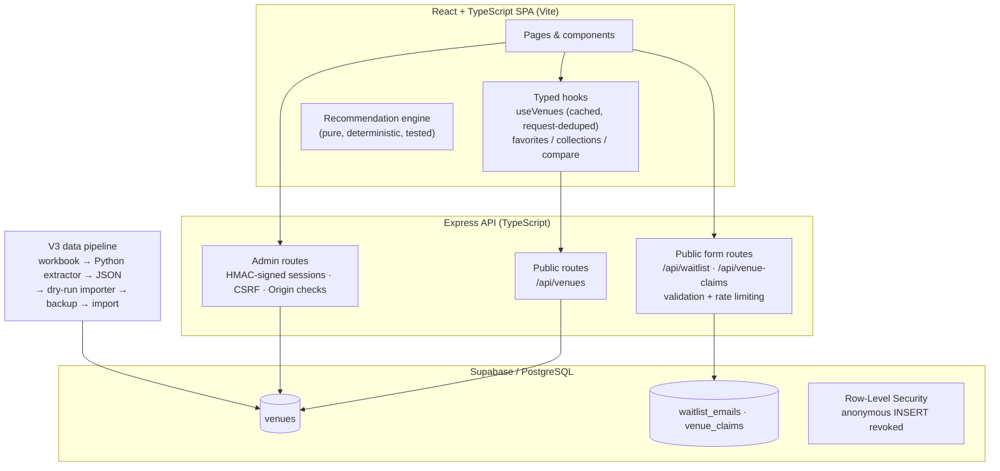

# Blaniko

[](https://github.com/achraf059/blaniko/actions/workflows/ci.yml)

Blaniko is a full-stack activity-discovery and outing-planning platform for Casablanca, Morocco, built around structured venue data, preference-based recommendations, and a security-conscious backend. It was developed iteratively over several months as a software-engineering project: a React/TypeScript SPA, an Express API, a PostgreSQL database (Supabase) with row-level security, a verification-aware data pipeline, and an automated test suite enforced in CI.

## Project Overview

The product answers one question well: *"What can I do in Casablanca?"*

- **Discovery** — browse venues by category (activities, sports, gaming, outdoor, family, wellness), area, and structured tags.
- **Outing planning** — a quiz-style planning flow that turns preferences (who you're going with, atmosphere, category) into a concrete venue plan.
- **Recommendations** — deterministic, structured-data-first ranking (see below).
- **Venue detail pages** — structured metadata, verification status, booking information, EN/FR content.
- **Favorites, collections, compare, recent activity** — client-side state via typed localStorage hooks.
- **Admin venue management** — a PIN-protected admin surface backed by server-side sessions.
- **Full English/French localization** through a typed dictionary system.

## Architecture



The key architectural boundary: **all public state-changing writes go through Express, never directly to the database.** An earlier iteration allowed anonymous Supabase inserts for the waitlist and venue-claim forms; that was deliberately reversed (migration `20260723000000_revoke_anon_insert_public_forms.sql`) so every write passes server-side validation and rate limiting, with the backend using a service-role key that never reaches the client. See [docs/technical-decisions/public-form-security.md](docs/technical-decisions/public-form-security.md).

## Core Engineering Highlights

- **Express backend with structured route separation** — public venue reads, public form writes, and admin operations are separate routers with separate middleware stacks.
- **Server-side admin authentication** — the admin PIN exists only on the server; login issues an HMAC-SHA256-signed, HttpOnly, path-scoped session cookie.
- **CSRF protection and Origin allow-listing** on all state-changing admin requests, with `crypto.timingSafeEqual` for secret and token comparison.
- **Layered rate limiting** — separate limiters for login attempts, admin operations, and public form submissions.
- **Supabase/PostgreSQL row-level security** with anonymous insert grants explicitly revoked; 15 sequential SQL migrations document the schema's evolution.
- **Deterministic recommendation engine** — structured-first matching with seeded FNV-1a tie-breaking, protected by invariant tests.
- **Shared in-flight request deduplication** — `useVenues` caches venue data at module level and shares a single in-flight promise across all mounted components, so the API is called once per session.
- **Typed EN/FR i18n** — a `Dictionary` type makes missing translations a compile error.
- **Verification-aware V3 data pipeline** — workbook extraction, dry-run validation, verified timestamped backups, and a documented ID crosswalk between numbering generations.

## Recommendation & Outing Planning

The recommendation logic is a deterministic, heuristic engine over structured venue data — not ML, and intentionally so at this dataset size.

- **Structured-first matching**: audience tags, atmosphere tags, and category constraints from the V3 dataset drive scoring; legacy computed tags act as a fallback for venues without structured data.
- **The explicit category wins**: if the user asks for sports, the main recommendation is a sports venue whenever an eligible one exists — style preferences can reorder within a category but never override it.
- **Deterministic ranking with seeded tie-breaking**: equally-scored venues are ordered by a seeded FNV-1a hash, so identical inputs always produce identical plans, while different seeds rotate fairly through tied peers. The previous modulo-based tie-break had a structural period that made some venues unreachable; the redesign is documented in [docs/technical-decisions/recommendation-tie-break.md](docs/technical-decisions/recommendation-tie-break.md).
- **Price is intentionally excluded from scoring** while venue pricing remains unverified, and **area/neighborhood does not filter or reorder results** where location data has not been sufficiently verified. Both exclusions are enforced by tests, not just convention.

## Venue Data Model

The dataset is a curated collection of roughly 100 Casablanca venues (96 active; 3 retired IDs are permanently reserved and can never be reassigned). Each venue carries structured fields including:

- category / subcategory (canonical 8-category V3 system) and additional experiences
- audience tags and atmosphere tags
- indoor/outdoor classification
- booking method and booking link
- contact and location information
- research status, verification level, last-verified date, and verifier

The dataset is **verification-aware**: every record tracks how far its data has been verified, and unverified fields stay empty rather than being guessed. Concretely:

- Venue pricing is deliberately **unknown and unscored** until directly verified in Morocco.
- Placeholder values (e.g. "Not confirmed") are suppressed at the API layer and never rendered as real addresses or neighborhoods.
- No venue partnerships are claimed; venues are catalogued from research, not onboarded.
- Venue imagery in the current MVP is illustrative/demo content and is intended to be progressively replaced with venue-approved imagery during future onboarding.

## Data Pipeline

```
official workbook (.xlsx)
  → Python extractor (scripts/extract_v3_to_json.py)
  → validated JSON payload
  → TypeScript importer (backend/scripts/importV3Venues.ts)
      --dry-run          validate + summarize, no DB writes
      --confirm-replace  timestamped verified backup, then import
  → Supabase/PostgreSQL
```

Pipeline properties worth noting:

- The extractor **fails loudly rather than silently falling back** to an older workbook if the expected source file is missing.
- The importer **refuses to run without a dry-run-validated payload**, takes a timestamped backup of existing rows, and verifies the backup by reading it back before any destructive step.
- Venue identity is stable: `BLK-XXXX` external IDs are permanent, and the transition between the pre-V3 and V3 numbering systems is captured in a machine-readable [ID crosswalk](docs/venue-id-crosswalk-pre-v3-to-v3.md) with zero unverified mappings. See [docs/technical-decisions/v3-data-migration.md](docs/technical-decisions/v3-data-migration.md).

## Backend Security

- **Admin PIN never leaves the server** — the frontend has no compiled-in credentials (enforced by a test that greps the frontend source for the env var).
- **Signed sessions**: login issues a random 256-bit token, HMAC-SHA256-signed with a server secret, delivered as an HttpOnly cookie scoped to `/api/admin`.
- **CSRF tokens** are required on all state-changing admin requests and validated with timing-safe comparison.
- **Origin allow-listing**: state-changing requests from unknown or missing origins are rejected.
- **Rate limiting in layers**: 5 login attempts per window, separate admin-operation and public-form limiters (20 requests / 15 min per IP).
- **Input validation on every public write** (email format, enum whitelists, length caps, URL/phone format), with database errors mapped to generic responses that leak no internals.
- **Database posture**: Supabase RLS enabled; anonymous insert grants revoked; all writes flow through the Express service-role client.

Honest limitations: this is a **single-admin MVP auth design**, not a multi-user identity system, and admin sessions are held **in memory** (a server restart logs the admin out). Both are acceptable at this stage and documented rather than hidden.

## Testing & Engineering Quality

**101 automated tests** (75 backend, 26 frontend), all enforced in CI alongside linting, type checking, and production builds.

Backend (Vitest + Supertest, Supabase fully mocked — no credentials needed):

- login, session cookies, logout, and session invalidation
- CSRF enforcement and Origin validation
- rate-limiter isolation (session checks must not consume the login limiter)
- public form endpoints: validation, normalization, duplicate mapping (Postgres `23505` → HTTP 409), generic error responses, rate-limit behavior
- venue mapping: V3 structured fields take precedence, fallbacks compute correctly, placeholders are suppressed, verification metadata maps through, unverified data stays absent

Frontend (Vitest):

- recommendation invariants: the explicit category wins; plan style cannot override it
- determinism: identical inputs and seed produce identical selections
- price non-influence and area non-influence on ranking
- area filter logic

CI runs two independent jobs on every push and pull request to `dev`, `staging`, and `main`: frontend (lint → typecheck → tests → build) and backend (TypeScript build → tests).

## Selected Technical Challenges

1. **[Recommendation tie-break redesign](docs/technical-decisions/recommendation-tie-break.md)** — why the original modulo-based tie-break made some venues structurally unreachable, and how a seeded FNV-1a hash (with the seed hashed *first*) fixed it.
2. **[Public form security architecture](docs/technical-decisions/public-form-security.md)** — migrating from anonymous database inserts to Express-mediated writes with validation, rate limiting, and revoked anonymous grants.
3. **[V3 venue data migration](docs/technical-decisions/v3-data-migration.md)** — evolving the schema to structured tags and verification metadata while keeping venue identity stable across two numbering systems.

## Project Structure

```
frontend/          React + TypeScript SPA (Vite)
  src/pages/       route-level pages (lazy-loaded)
  src/components/  reusable UI
  src/hooks/       typed localStorage + API hooks
  src/utils/       recommendation engine + helpers (tested)
  src/i18n/        typed EN/FR dictionary system
backend/           Express API (TypeScript)
  src/routes/      venues, waitlist, venue-claims, admin, admin auth
  src/middleware/  auth, CSRF, rate limiters
  src/__tests__/   backend test suites
  scripts/         V3 importer and data maintenance scripts
supabase/          15 sequential SQL migrations
scripts/           Python extractor + data tooling
docs/              pipeline, crosswalk, technical decision records
.github/           CI workflow
```

## Local Setup

Requires Node 20+.

```bash
# Frontend (works standalone; falls back to bundled sample data without a backend)
cd frontend
npm ci
npm run dev        # http://localhost:5173
npm run test
npm run build

# Backend (requires a Supabase project)
cd backend
npm ci
cp .env.example .env   # fill in Supabase URL/key, admin PIN, session secret
npm run dev            # http://localhost:3001
npm run test           # no environment or credentials needed
npm run build
```

Backend configuration is documented in [`backend/.env.example`](backend/.env.example). Supabase schema is reproduced by applying the migrations in `supabase/migrations/` in order.

## Current Limitations

- Public user accounts are **not part of the active MVP**. Supabase magic-link groundwork (login page, auth provider, profile migrations) exists and degrades gracefully when unconfigured, but it is not a shipped feature.
- Admin authentication is a single-admin MVP design with in-memory sessions.
- Venue pricing is intentionally absent until directly verified; it does not influence recommendations.
- Some venue coordinates are incomplete, so map coverage is partial.
- Venue imagery is illustrative/demo content pending venue-approved photography.
- Venue verification is ongoing; records carry explicit research/verification status rather than implied completeness.
- No booking or payment functionality — the product is discovery-focused by design.
- Recommendations are heuristic/structured, not ML — a deliberate choice at ~100 venues.
- Backend deployment is not yet fully documented (the frontend deploys via Netlify).

## Development Process

Developed over several months through feature branches and pull requests into a `dev` integration branch, with `staging` and `main` as promotion targets. Every PR runs the full CI matrix. Larger changes — the Next.js→Vite migration, the V0→V3 data model evolution, the anonymous-insert reversal — were landed as incremental, reviewable migrations rather than rewrites, and the repository history preserves that record.

## Author

Primary developer: **Achraf Ait Tayeb** — Software Engineering student at Sichuan University.
